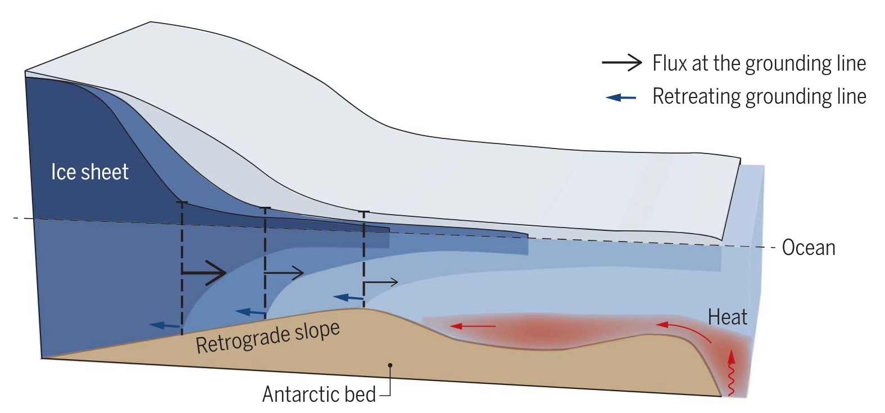
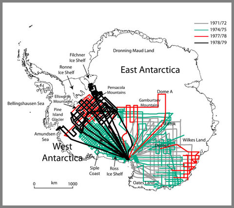
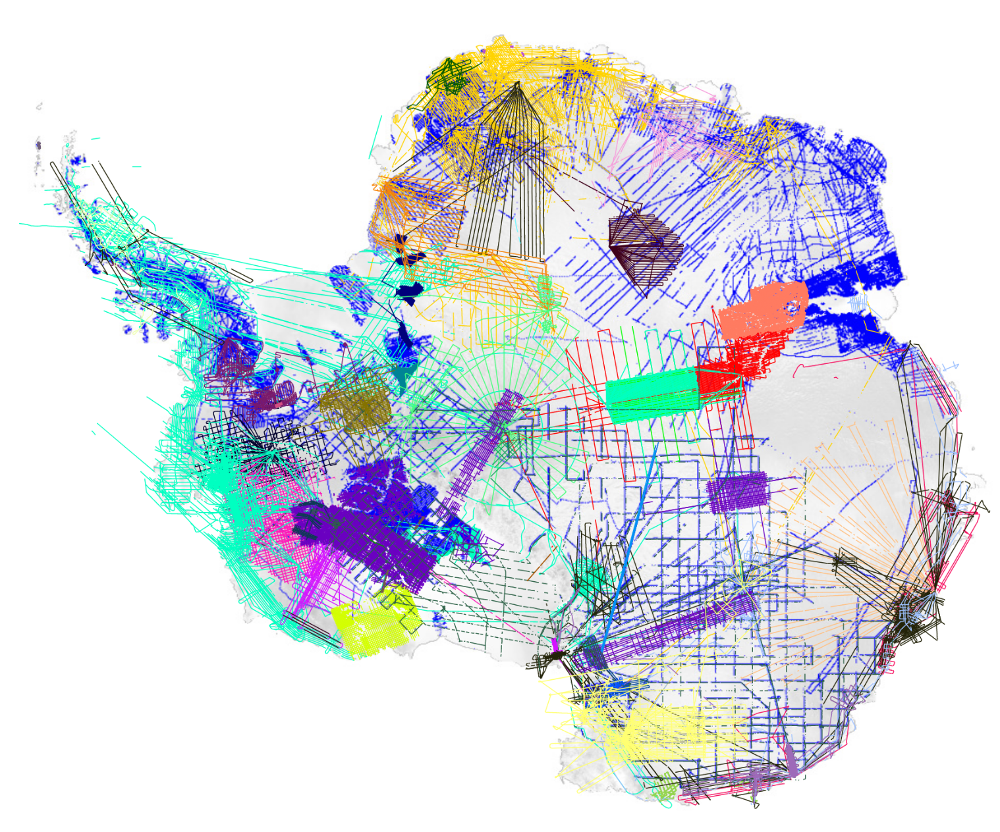
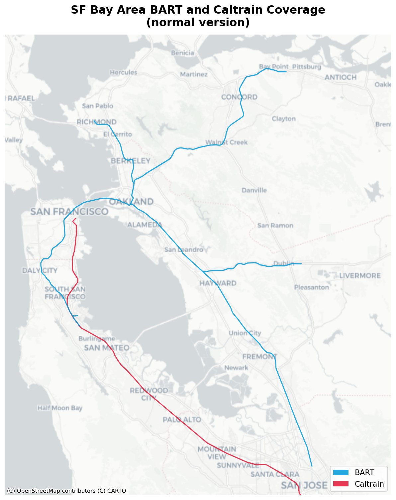
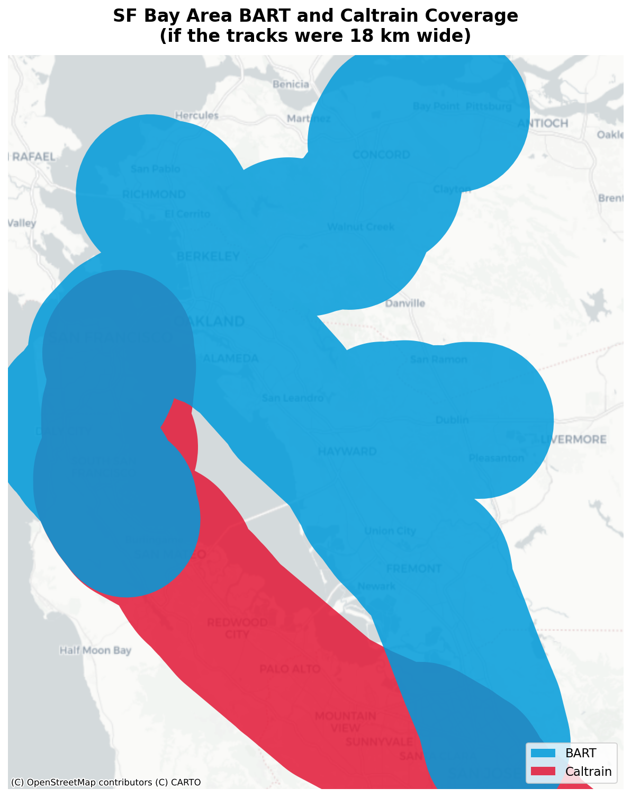
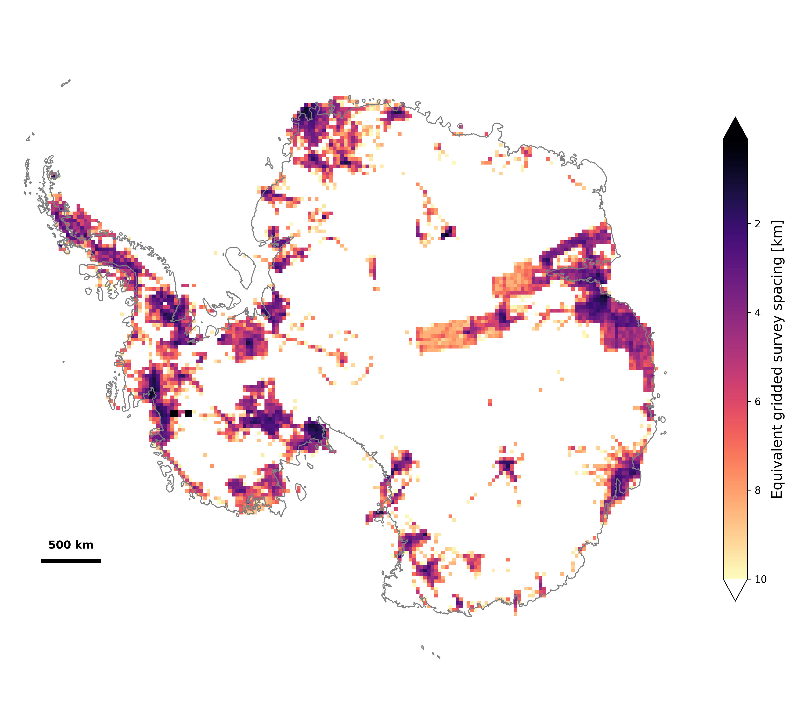
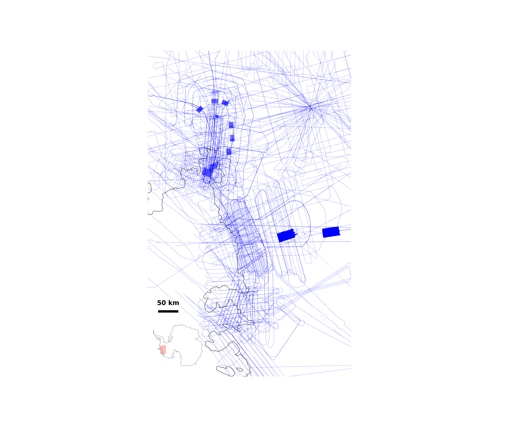
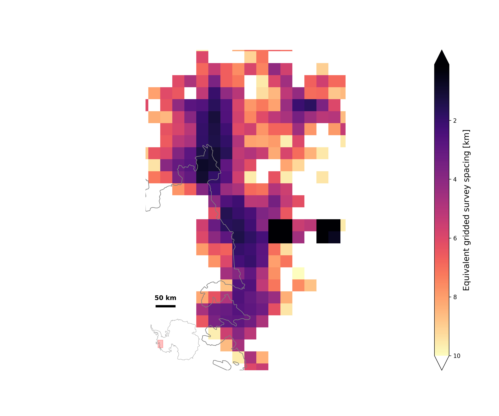
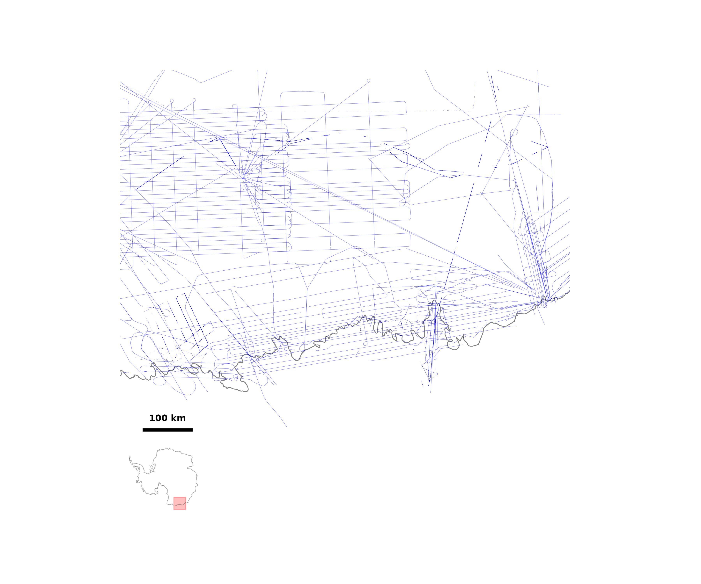
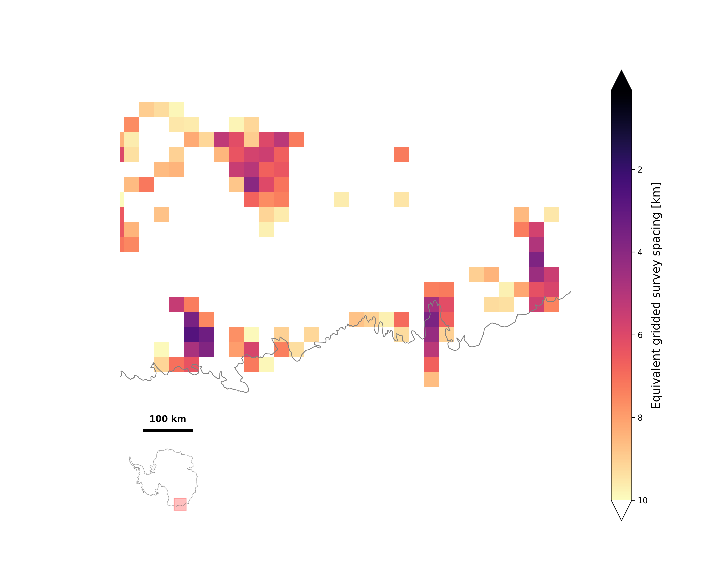

Radar sounders are one of our core tools for understanding Antarctica and Greenland. Both ice sheets cover enormous land masses. Unlike the rest of the world, we can't directly observe where the land actually is because it's covered by hundreds to thousands of meters of ice. Radar sounders allow us, among other things, to see through the ice and map what the topography looks like beneath the ice. If radar sounders are entirely new to you, [Laura Lindzey's blog post](https://lindzey.github.io/blog/2015/07/27/a-brief-introduction-to-ice-penetrating-radar/) is a nice introduction.

It's a common refrain that we need more data, but the maps we have don't tell that story well. This post will give a bit of an introduction to why radar sounder data is important, but the core point is to argue that we should use a different set of maps in thinking about where we need more data and why.

(Side note: Radar sounders are also called radio-echo sounders, ice-penetrating radar, radar depth sounders, ground-penetrating radar, and all sorts of other names, depending on the context. I apologize on behalf of my field.)

### A bit of history

Since the 1950s, we've known that radar could be used to map the internal structure and the bedrock beneath glaciers and ice caps. In the 1960s and 70s, a collaborative effort between the Scott Polar Research Institute in the UK, the NSF in the US, and the Technical University of Denmark carried out an ambitious effort to map the the bedrock beneath Antarctica and Greenland, allowing estimates for the first time of one of the most basic questions: "how much ice is there?"

.)](images/spri-planning.png)

By 1982, we had a preliminary answer to this question: 30.11 +/- 2.5 million cubic kilometers, based off of "flight tracks covering 50% of the Antarctic Ice Sheet on a 50 to 100 km square grid," as published by @drewry_measured_1982 (of the above image).

Sixty-some years later, we're still using radar sounder data collected by aircraft to refine our estimates of the total mass and its associated potential sea level rise (the current best estimate is slightly lower at 26 +/- 0.4 million cubic kilometers, corresponding to 57.9 +/- 0.9 meters of equivalent sea level rise for Antarctica [@morlighem_deep_2019], if you're curious).

### Topography and sea level rise

Although this tell us how much sea level rise Antarctica could cause, no one is projecting that all of Antarctica will melt anytime soon. The much more pressing question is: "how much of this ice could end up in the oceans in the next 20 years? 50 years? 100 years?"

As it turns out, knowing where the the bedrock is beneath the ice, especially in the coastal regions where ice flows out towards the ocean, is crucially important to answering this question.

Most of coastal Antarctica consists of so-called "marine-terminating glaciers," meaning that the ice flows all the way out to the ocean. This ice-ocean interface is where most of the melting happens, particularly when warmer water from deep in the ocean comes in contact with the ice. As the ice melts, the glacier "retreats" backward. If the slope of the bed topography gets deeper as you go further inland, the area of the ice in contact with warm ocean water increases, thus increasing the rate of melt, and increasing the rate of retreat. This is the basic positive feedback loop underpinning the idea of "marine ice sheet instability."

So if the topography of the bedrock gets lower and lower as you go inland (as it generally does in large regions of Antarctica), this is bad news for sea level rise. On the other hand, a small hill or ridge in that topography might create a point where the glacier slows its rate of melt and perhaps gets held up for years (or hundreds of years). This is all a dramatic oversimplification, but hopefully it provides a general idea of why understanding near-coastal bedrock topography is extremely important to making good predictions about sea level rise.

The full details are way beyond the scope of this post, but if you want to dive in more to why bedrock topography is so important to predicting sea level rise, [this is a great explainer](https://blogs.egu.eu/divisions/cr/2016/06/22/marine-ice-sheet-instability-for-dummies-2/).

### Filling in the map

So we need a good map of the topography beneath the ice. We've been working on this for 60 years or so. How are we doing? The problem of getting the bed topography across an ice sheet is often referred to as "filling in the map," so how filled in are the maps?

::: {layout-ncol=3}

:::

These three maps show all available radar sounder flight lines to date over Antarctica from 1980, 2014, and 2019. It looks like quite a lot of progress has been made since 1980. **It should be a bit surprising, then, that lack of knowledge of bed topography continues to be identified as a leading source of uncertainty in sea level rise estimates** (see, for example, @pritchard_bedgap:_2014, @seroussi_continued_2017, @schlegel_exploration_2018, or @castleman_derivation_2022, among many others).

There's a fundamental problem with using the flight line maps as an indication of bed topography coverage. On the map on the right, for example, each line is roughly 12-18 kilometers wide, but radar sounders (mostly) measure the topography immediately below the aircraft, not over a wide swath. (And those that do measure a swath measure one that is much smaller than 18 kilometers.)

It's worth pointing out that most of these maps were not made with the intention of serving as a guide of how much we have left to fill in, but they are, nonetheless, often used that way for lack of anything better.

To illustrate this point in a more entertaining way, let's say you were looking at a map of the BART and Caltrain public transit systems in the San Francisco Bay Area, with each route line having a width of 18 kilometers (right) or a more normal width (on the left) to give you some context.

::: {layout-ncol=2}

:::

If you only had the map on the right, you might conclude, for example, that all of San Francisco is within easy walking distance of both of these two public transit rail systems. Even recognizing that these tracks are unrealistically wide, you might make some incorrect inferences, such as assuming that they connect in San Francisco and San Jose (they do not — the connection point in is Millbrae).

This example is perhaps a bit contrived, but it hopefully illustrates the challenge of representing radar coverage on a continent almost 50% larger than the contiguous US.

### A better visualization for the purpose

We can draw inspiration for better visualizations from how studies looking at bed topography resolution talk about their recommendations. There have been many studies examining what resolution of bed topography (derived from radar sounder data) is needed to get accurate sea level rise estimates. Quoting from the recommendations of a few selected studies:

> In the context of short‐term ice sheet forecast, we show that in coastal regions, the bedrock
elevation should be known **at a resolution of the order of one kilometer**.
[@durand_impact_2011]

> The sea-level contribution indicates a converging behaviour **below a 1 km horizontal resolution**.
[@ruckamp_sensitivity_2020]

> Experiments that test spatial resolution requirements suggest that we need bedrock geometry to be **measured at a spatial resolution of 2 km or less** in order to accurately characterize the bedrock topography pinning points and to minimize ice-sheet model uncertainty on 200-year timescales. In particular, we find that at a resolution finer than approximately 2 km (at sensitive glacial regions), estimated SLR contribution converges (Fig. 3).
[@castleman_derivation_2022]

So our goal is somewhere on the order of 1 to 2 km spacing between radar sounder data. How close are we to that based on our maps? It's impossible to say while we're drawing the lines with 10+ kilometer width.

Another way to map coverage is to take small regions and ask "if all of the survey lines in this region had been part of a uniform gridded survey, what would the spacing of those grid lines be?" This gives us a way to plot data density — and the studies above give us some idea of the target metrics. This handy interactive visualization (generated by Claude) shows how this metric maps flight lines to equivalent survey density:



### Equivalent gridded survey spacing maps

Applied to all of Antarctica with 30 km grid cells, this is the map we get:

This heatmap reflects a lot of interesting properties of how airborne surveying in Antarctica works. Surveying is concentrated around where there are research facilities (and, therefore, runways). There are, of course, some heavily surveyed areas away from any permanent facilities too. These are the result of dedicated campaigns that usually set up temporary field camps to support intensive surveying in a region of particular interest.

There's a lot of white on this map (corresponding to 30 kilometer cells with less than 10 kilometer equivalent grid density) and very little black (corresponding to the roughly 1 kilometer equivalent gridded spacing recommended by some of the studies above). Luckily, those studies were looking at specific near coastal areas, where models are much more sensitive to small changes than in the interior, so **you can think of the target as filling in a ring of dark purple to black around the coastline**, rather than filling in the entire continent. We're a long way from where we'd like to be.

We can get a better sense by looking at the Amundsen Sea Embayement, a region containing the much-discussed Thwaites and Pine Island glaciers responsible for the fastest mass loss in Antarctica today.

Drag the slider to see the raw flight lines view versus the equivalent gridded spacing heatmap.

<link rel="stylesheet" href="https://cdn.knightlab.com/libs/juxtapose/latest/css/juxtapose.css">

<noscript>
::: {layout-ncol=2}

:::
</noscript>

Thwaites and Pine Island have attracted a lot of attention over the past two decades due to their rapid mass loss and the potential that they retreat and provide a pathway for warm ocean water to reach the deep interior of the West Antarctic Ice Sheet, which stores 3-5 meters of equivalent global sea level rise. This map clearly shows that focus on Thwaites and Pine Island, with these glaciers among the best surveyed regions of anywhere except the immediate vicinity of research stations.

(The extremely dense grids that correspond to the black blobs in the density map are from an experimental survey that flew many closely-spaced lines to create a two-dimensional topographic map of the bed in the region [@holschuh_linking_2020].)

Most coastal areas don't receive the same attention. The Wilkes Subglacial Basin in East Antarctica has a similar reverse-sloping bed and is grounded well below sea level. It contains about 3-4 meters of equivalent sea level, much of which drains through Cook Glacier [@crotti_wilkes_2022]. In contrast to Thwaites, the coastal regions around Cook Glacier have far less data around the grounding zone.

<noscript>
::: {layout-ncol=2}

:::
</noscript>

### Use these maps

The point of this post is not to convince you that we need to rethink how we collect radar sounder data to make Antarctica a data-rich continent (though we do). The point is that we should think beyond flight line maps in considering our data coverage and resolution. The good news is that [xOPR](https://github.com/englacial/xopr) makes it really easy to reproduce figures like these. The code to produce these figures is MIT-licensed and [available on GitHub](https://github.com/englacial/radar-data-availability) (and a collection of useful figures like these are dynamically built and hosted on the [docs page](https://docs.englacial.org/radar-data-availability/) of that repo). So the next time you need a figure showing radar sounder data coverage, grab one of these or remix your own customized version.

### What's missing here

In reality, there's a lot more to radar sounder coverage than just "filling in the map."
This post is about better visualizations, but there's a lot more to consider. We'll leave
these topics to future posts, but here are few things to consider:

* Access to data matters -- the data plotted above is radar sounder data that exists but not necessarily data that's available publicly. We're working hard on changing that.
* Not all data is of the same quality or fit for the same purpose. Radar sounders are not commodity instruments. The best instruments for producing the detailed swath topography surveys pointed out above are not the same as the best instruments for seeing through the deepest ice or making the best radiometric measurements.
* Radar sounders aren't just about topography. Radar sounders can also tell us about the presence of water, the internal velocity structure, the ice temperature, and more. These are all signals that change on much faster timescales than the bedrock (which does also change, just slowly). As we see accelerating changes in the polar regions, having repeat measurements becomes increasingly important.
